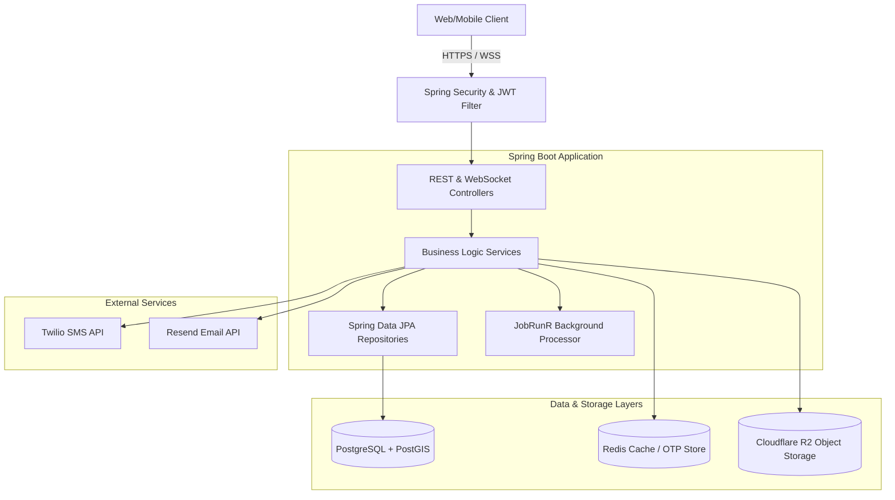
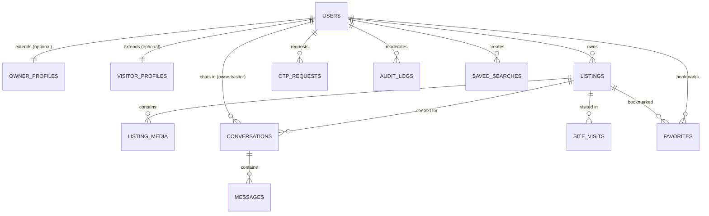

# RoomConnect Server

RoomConnect is a high-performance, spatial-enabled rental accommodation platform. This repository contains the Spring Boot backend API server that facilitates listing search, geographic filtering, real-time messaging, scheduled site visits, media management, and administrative moderation.

---

## 🗺️ Architectural Overview

RoomConnect is built on a 3-tier architecture with separate caching and storage layers for optimal scalability, spatial query speed, and data integrity.



### Core Architecture Components
1. **API Layer**: Exposes RESTful endpoints and WebSockets for real-time chat.
2. **Security & RBAC**: Enforces Role-Based Access Control (roles: `owner`, `visitor`, `admin`) using Spring Security and JWT.
3. **Database**: PostgreSQL with PostGIS extension enabled to support geo-spatial matching and distance indexing.
4. **Caching & OTP**: Redis handles rate-limiting tokens, caching, and transient OTP session validation hashes.
5. **Object Storage**: Cloudflare R2 stores media with direct-to-bucket pre-signed upload URLs to reduce server payload processing.
6. **Background Tasks**: JobRunR handles asynchronous, persistent background tasks like listing image thumbnail generation.

---

## 🗄️ Database Schema Design

The application's relational data model is managed via Flyway migrations. Below is the Entity-Relationship layout:



### Table Specifications

* **`users`**: Contains auth credentials (phone, email, password hash), verification flags, role, status (`active` or `suspended`), and the critical `consent_at` timestamp for compliance.
* **`owner_profiles`** & **`visitor_profiles`**: Maintain role-specific attributes. Owners have property addresses, landmarks, etc.; Visitors have profession, home address, etc.
* **`listings`**: Features a `GEOGRAPHY(Point, 4326)` spatial column auto-generated from latitude and longitude. Includes a generated GIN index `search_vector` for Postgres Full-Text Search.
* **`listing_media`**: Holds references to original files in Cloudflare R2, auto-generated thumbnails, sort order, and asynchronous processing status (`pending`, `done`, `failed`).
* **`conversations` & `messages`**: Models real-time messaging rooms and individual messages.
* **`site_visits`**: Manages site visit tour requests, dates, status (`requested`, `confirmed`, `declined`, `completed`, `cancelled`), and owner notes.
* **`favorites`**: A join table mapping a visitor's saved listing bookmarks.
* **`saved_searches`**: Stores complex JSON filter criteria to enable automatic notification alerts when new matches are published.
* **`audit_logs`**: Tracks admin moderation actions (e.g., suspending a user or post) for compliance.

---

## 🔐 Compliance & Security

### Digital Personal Data Protection (DPDP) Compliance
* During registration, users must check and agree to terms. The backend requires `consent: true` in the registration request.
* A timestamp is captured in the database (`consent_at`) to audit compliance.

### Authentication & Authorization
* Access tokens are short-lived JWTs. Refresh tokens are exchanged to maintain session validity.
* The JWT carries the authenticated user's `userId`, `role`, and `phone` to perform controller-level authorization checks.
* Annotations like `@PreAuthorize("hasRole('owner')")` secure restricted endpoints.

---

## ⚙️ Key Workflows

### 1. SMS OTP Authentication Flow
```
Client                      Server                      Redis/DB                    Twilio
  |                           |                           |                           |
  |--- POST /otp/send ------->|                           |                           |
  |    (Phone number)         |--- Hash OTP & Save ------>|                           |
  |                           |    (Expiring in 5 min)    |                           |
  |                           |------------------------------------------------------>|
  |                           |                           |                           | Send SMS
  |                           |<-- 200 OK ----------------|                           |
  |                           |                           |                           |
  |--- POST /otp/verify ----->|                           |                           |
  |    (Code + Phone)         |--- Verify Code Hash ----->|                           |
  |                           |    (Match & Delete)       |                           |
  |                           |--- Generate JWT (HS256) ->|                           |
  |<-- JWT Tokens & Details --|                           |                           |
```

### 2. Direct-to-R2 Media Upload Flow
```
Client                      Server                     Cloudflare R2               JobRunR
  |                           |                              |                        |
  |--- POST /media/presign -->|                              |                        |
  |    (mimeType, sizeBytes)  |-- Generate Presigned URL --> |                        |
  |<-- Presigned PUT URL -----|                              |                        |
  |                           |                              |                        |
  |--- PUT Media File -------------------------------------->|                        |
  |<-- 200 OK -----------------------------------------------|                        |
  |                           |                              |                        |
  |--- POST /media/confirm -->|                              |                        |
  |    (Upload verified)      |-- Enqueue Thumbnail Job ----------------------------->|
  |                           |                              |                        | Asynchronously
  |<-- 200 OK ----------------|                              |                        | download, resize,
                                                                                      | and upload thumbnail
```

---

## 📖 API Documentation & Payload Reference

The standard error payload returned for error codes is:
```json
{
  "message": "Resource not found",
  "status": 404,
  "timestamp": "2026-07-17T17:15:16"
}
```
Validation errors return a `422 Unprocessable Entity` code mapping the fields to their corresponding validation messages:
```json
{
  "phone": "Phone must be between 10 and 15 digits",
  "fullName": "Full name is required"
}
```

---

### Authentication Module
Endpoints implemented in [AuthController.java](file:///home/lol/roomconnect-server/src/main/java/com/roomconnect/modules/auth/controller/AuthController.java).

#### `POST /api/auth/signup`
Creates a pending user account.
* **Authentication**: Public
* **Request Body**:
```json
{
  "phone": "9876543***",
  "email": "user@example.com",
  "role": "visitor", 
  "fullName": "Bhanu Pratap",
  "consent": true
}
```
* **Response Body (`200 OK`)**:
```json
{
  "userId": "d3b07384-d113-49cd-a5d6-8ee8df004123",
  "phone": "9876543***",
  "role": "visitor",
  "message": "Signup successful. Please verify OTP."
}
```

#### `POST /api/auth/otp/send`
Requests Twilio SMS OTP dispatch.
* **Authentication**: Public
* **Request Body**:
```json
{
  "phone": "9876543***"
}
```
* **Response Body (`200 OK`)**:
```json
{
  "message": "OTP sent successfully"
}
```

#### `POST /api/auth/otp/verify`
Verifies OTP and issues credentials.
* **Authentication**: Public
* **Request Body**:
```json
{
  "phone": "9876543***",
  "code": "123456"
}
```
* **Response Body (`200 OK`)**:
```json
{
  "accessToken": "eyJhbGciOiJIUzI1NiJ9...",
  "refreshToken": "eyJhbGciOiJIUzI1NiJ9...",
  "userId": "d3b07384-d113-49cd-a5d6-8ee8df004123",
  "role": "visitor",
  "phone": "9876543***"
}
```

---

### User Module
Endpoints implemented in [UserController.java](file:///home/lol/roomconnect-server/src/main/java/com/roomconnect/modules/users/controller/UserController.java).

#### `GET /api/users/me`
Retrieves authenticated profile data.
* **Authentication**: JWT (Any role)
* **Response Body (`200 OK`)**:
```json
{
  "id": "d3b07384-d113-49cd-a5d6-8ee8df004123",
  "phone": "9876543***",
  "email": "visitor@example.com",
  "role": "visitor",
  "fullName": "Bhanu Prakash",
  "homeAddress": "123 Main St, New Delhi",
  "cityId": 1
}
```

#### `PUT /api/users/me`
Updates user profile metadata.
* **Authentication**: JWT (Any role)
* **Request Body**:
```json
{
  "email": "updated@example.com",
  "fullName": "Bhanu Prakash Updated",
  "homeAddress": "456 Side St, Noida",
  "cityId": 1
}
```
* **Response Body (`200 OK`)**:
```json
{
  "id": "d3b07384-d113-49cd-a5d6-8ee8df004123",
  "phone": "9876543210",
  "email": "updated@example.com",
  "role": "visitor",
  "fullName": "Bhanu Prakash Updated",
  "homeAddress": "456 Side St, Noida",
  "profession": "Architect",
  "cityId": 1
}
```

---

### Listings Module
Endpoints implemented in [ListingController.java](file:///home/lol/roomconnect-server/src/main/java/com/roomconnect/modules/listings/controller/ListingController.java).

#### `POST /api/listings`
Creates a property listing.
* **Authentication**: JWT (Role: `owner`)
* **Request Body**:
```json
{
  "title": "Cozy single room near Noida Sector 62",
  "description": "Fully furnished room close to Metro, includes high speed Wifi.",
  "category": "independent_room", 
  "rentAmount": 12000.00,
  "depositAmount": 24000.00,
  "bathroomType": "attached", 
  "furnishing": "Fully Furnished",
  "genderPreference": "any", 
  "foodIncluded": true,
  "foodType": "veg", 
  "curfewTime": "22:00:00",
  "ac": "ac", 
  "wifi": true,
  "parking": true,
  "laundry": false,
  "addressText": "H-123, Sector 62, Noida",
  "latitude": 28.6219,
  "longitude": 77.3798,
  "availableFromDate": "2026-08-01",
  "cityId": 1
}
```
* **Response Body (`200 OK`)**:
```json
{
  "id": "e9c08495-e224-50de-b6e7-9ff9ef115234",
  "ownerId": "a1b2c3d4-e5f6-7a8b-9c0d-1e2f3a4b5c6d",
  "cityId": 1,
  "category": "independent_room",
  "title": "Cozy single room near Noida Sector 62",
  "description": "Fully furnished room close to Metro, includes high speed Wifi.",
  "rentAmount": 12000.00,
  "depositAmount": 24000.00,
  "bathroomType": "attached",
  "furnishing": "Fully Furnished",
  "genderPreference": "any",
  "foodIncluded": true,
  "foodType": "veg",
  "curfewTime": "22:00:00",
  "ac": "ac",
  "wifi": true,
  "parking": true,
  "laundry": false,
  "addressText": "H-123, Sector 62, Noida",
  "latitude": 28.6219,
  "longitude": 77.3798,
  "status": "AVAILABLE",
  "availableFromDate": "2026-08-01",
  "createdAt": "2026-07-17T17:15:16Z",
  "updatedAt": "2026-07-17T17:15:16Z",
  "media": null
}
```

#### `GET /api/listings/{id}`
Fetches details of a specific listing (including media arrays).
* **Authentication**: Public
* **Response Body (`200 OK`)**:
```json
{
  "id": "e9c08495-e224-50de-b6e7-9ff9ef115234",
  "ownerId": "a1b2c3d4-e5f6-7a8b-9c0d-1e2f3a4b5c6d",
  "cityId": 1,
  "category": "independent_room",
  "title": "Cozy single room near Noida Sector 62",
  "description": "Fully furnished room close to Metro, includes high speed Wifi.",
  "rentAmount": 12000.00,
  "depositAmount": 24000.00,
  "bathroomType": "attached",
  "furnishing": "Fully Furnished",
  "genderPreference": "any",
  "foodIncluded": true,
  "foodType": "veg",
  "curfewTime": "22:00:00",
  "ac": "ac",
  "wifi": true,
  "parking": true,
  "laundry": false,
  "addressText": "H-123, Sector 62, Noida",
  "latitude": 28.6219,
  "longitude": 77.3798,
  "status": "AVAILABLE",
  "availableFromDate": "2026-08-01",
  "createdAt": "2026-07-17T17:15:16Z",
  "updatedAt": "2026-07-17T17:15:16Z",
  "media": [
    {
      "id": "b7c2a112-9c12-4c28-98e1-d245cba896f2",
      "url": "listing-media/e9c08495-e224-50de-b6e7-9ff9ef115234/file-id.jpg",
      "thumbnailUrl": "listing-media/e9c08495-e224-50de-b6e7-9ff9ef115234/file-id-thumb.jpg",
      "sortOrder": 0
    }
  ]
}
```

#### `PUT /api/listings/{id}`
Updates listing details.
* **Authentication**: JWT (Owner must own listing)
* **Request Body**: Same structure as `POST /api/listings`.
* **Response Body (`200 OK`)**: Updated listing response object.

#### `PATCH /api/listings/{id}/status?status={status}`
Updates listing state (`AVAILABLE`, `OCCUPIED`, `AVAILABLE_FROM`).
* **Authentication**: JWT (Owner must own listing)
* **Response Body (`200 OK`)**:
```json
{
  "message": "Status updated"
}
```

#### `DELETE /api/listings/{id}`
Removes listing.
* **Authentication**: JWT (Owner must own listing)
* **Response**: `240 No Content`

#### `GET /api/listings/my?page=0&size=20`
Lists all properties owned by the authenticated caller.
* **Authentication**: JWT (Role: `owner`)
* **Response Body (`200 OK`)**: Paginated JSON array containing listings items.

---

### 🖼️ Media Module
Endpoints implemented in [MediaController.java](file:///home/lol/roomconnect-server/src/main/java/com/roomconnect/modules/media/controller/MediaController.java).

#### `POST /api/listings/{listingId}/media/presign?mimeType=image/jpeg&sizeBytes=1048576`
Retrieves pre-signed endpoint for secure direct-to-storage uploads.
* **Authentication**: JWT (Role: `owner`)
* **Response Body (`200 OK`)**:
```json
{
  "mediaId": "b7c2a112-9c12-4c28-98e1-d245cba896f2",
  "fileKey": "listing-media/e9c08495-e224-50de-b6e7-9ff9ef115234/b7c2a112.jpg",
  "uploadUrl": "http://localhost:9000/rc-dev/listing-media/e9c08495-e224-50de-b6e7-9ff9ef115234/b7c2a112.jpg?X-Amz-Algorithm=..."
}
```

#### `POST /api/listings/{listingId}/media/{mediaId}/confirm`
Signals completed R2 payload placement, queuing thumbnail processing tasks.
* **Authentication**: JWT (Role: `owner`)
* **Response Body (`200 OK`)**:
```json
{
  "message": "Upload confirmed, thumbnail queued"
}
```

#### `DELETE /api/listings/{listingId}/media/{mediaId}`
Deletes resource records and corresponding R2 assets.
* **Authentication**: JWT (Role: `owner`)
* **Response**: `240 No Content`

---

### 🔍 Search Module
Endpoints implemented in [SearchController.java](file:///home/lol/roomconnect-server/src/main/java/com/roomconnect/modules/search/controller/SearchController.java).

#### `GET /api/search`
Queries listings based on spatial location, search radius, and filters.
* **Query Parameters**:
  * `lat` & `lng` (Required double, search center)
  * `radiusKm` (Optional double, default `5.0` km, max `20.0` km)
  * `category`, `genderPreference`, `minRent`, `maxRent` (Optional filters)
  * `wifi`, `parking`, `laundry`, `foodIncluded` (Optional booleans)
  * `ac`, `bathroomType` (Optional enum values)
  * `page` (Optional int, default `0`), `size` (Optional int, default `20`)
* **Authentication**: Public
* **Response Body (`200 OK`)**:
```json
{
  "items": [
    {
      "id": "e9c08495-e224-50de-b6e7-9ff9ef115234",
      "distanceMeters": 143.2,
      "title": "Cozy single room near Noida Sector 62",
      "rentAmount": 12000.00,
      "addressText": "H-123, Sector 62, Noida",
      "category": "independent_room"
    }
  ],
  "total": 1,
  "page": 0,
  "size": 20,
  "totalPages": 1
}
```

---

### 💬 Chat Module
Endpoints implemented in [ChatController.java](file:///home/lol/roomconnect-server/src/main/java/com/roomconnect/modules/chat/controller/ChatController.java) and [ChatWebSocketController.java](file:///home/lol/roomconnect-server/src/main/java/com/roomconnect/modules/chat/controller/ChatWebSocketController.java).

#### `GET /api/chat/conversations`
Retrieves conversations containing listing highlights.
* **Authentication**: JWT (Any role)
* **Response Body (`200 OK`)**:
```json
[
  {
    "id": "9f71c4c1-6b8c-4467-bc5b-ee4f7c22998a",
    "listingId": "e9c08495-e224-50de-b6e7-9ff9ef115234",
    "ownerId": "a1b2c3d4-e5f6-7a8b-9c0d-1e2f3a4b5c6d",
    "visitorId": "d3b07384-d113-49cd-a5d6-8ee8df004123",
    "createdAt": "2026-07-17T17:15:16Z",
    "lastMessageAt": "2026-07-17T17:16:15Z",
    "listingTitle": "Cozy single room near Noida Sector 62",
    "listingRent": 12000.00,
    "listingAddress": "H-123, Sector 62, Noida"
  }
]
```

#### `GET /api/chat/conversations/{id}/messages?page=0&size=20`
Fetches a chat room's message log history.
* **Authentication**: JWT (Must be participant)
* **Response Body (`200 OK`)**: Paginated list of messages:
```json
{
  "content": [
    {
      "id": "11a22b33-44c5-55d6-66e7-77f8fa9911bb",
      "conversationId": "9f71c4c1-6b8c-4467-bc5b-ee4f7c22998a",
      "senderId": "d3b07384-d113-49cd-a5d6-8ee8df004123",
      "body": "Hi, is this room still available?",
      "sentAt": "2026-07-17T17:16:15Z",
      "deliveredAt": "2026-07-17T17:16:20Z",
      "readAt": null
    }
  ],
  "pageable": { ... },
  "totalPages": 1
}
```

#### `POST /api/chat/conversations?listingId={listingId}`
Finds or registers a conversation thread channel.
* **Authentication**: JWT (Any role)
* **Response Body (`200 OK`)**: Conversation entity.

#### `WS /chat/send` (WebSocket Message Mapping)
Sends a message using the STOMP/WebSocket protocol.
* **Message Destination**: `/app/chat/send`
* **Message Format**:
```json
{
  "conversationId": "9f71c4c1-6b8c-4467-bc5b-ee4f7c22998a",
  "body": "Yes, it is available. Would you like to schedule a visit?"
}
```
* **Event Distribution**: Real-time broadcasts are dispatched to subscribers listening on `/topic/conversations/{conversationId}`.

---

### 📅 Site Visit (Tours) Module
Endpoints implemented in [SiteVisitController.java](file:///home/lol/roomconnect-server/src/main/java/com/roomconnect/modules/tours/controller/SiteVisitController.java).

#### `POST /api/tours`
Schedules a property viewing.
* **Authentication**: JWT (Role: `visitor`)
* **Request Body**:
```json
{
  "listingId": "e9c08495-e224-50de-b6e7-9ff9ef115234",
  "requestedTime": "2026-07-20T11:00:00Z",
  "notes": "Looking to inspect the AC unit during the tour."
}
```
* **Response Body (`200 OK`)**:
```json
{
  "id": "33a44b55-66c7-77d8-88e9-99f0fa1122cc",
  "listingId": "e9c08495-e224-50de-b6e7-9ff9ef115234",
  "visitorId": "d3b07384-d113-49cd-a5d6-8ee8df004123",
  "ownerId": "a1b2c3d4-e5f6-7a8b-9c0d-1e2f3a4b5c6d",
  "requestedTime": "2026-07-20T11:00:00Z",
  "status": "requested",
  "notes": "Looking to inspect the AC unit during the tour.",
  "createdAt": "2026-07-17T17:15:16Z",
  "updatedAt": "2026-07-17T17:15:16Z"
}
```

#### `GET /api/tours/visitor`
Lists tours booked by the calling visitor.
* **Authentication**: JWT (Role: `visitor`)
* **Response Body (`200 OK`)**: Array of rich tour responses.

#### `GET /api/tours/owner`
Lists tour bookings requested on the landlord's properties.
* **Authentication**: JWT (Role: `owner`)
* **Response Body (`200 OK`)**: Array of rich tour responses.

#### `PATCH /api/tours/{id}/status?status={status}`
Approves, declines, or cancels a tour booking (`requested`, `confirmed`, `declined`, `completed`, `cancelled`).
* **Authentication**: JWT (Must be participant)
* **Response Body (`200 OK`)**: Updated tour response object.

---

### ❤️ Favorites & 🔔 Alerts Modules
Endpoints implemented in [FavoriteController.java](file:///home/lol/roomconnect-server/src/main/java/com/roomconnect/modules/favorites/controller/FavoriteController.java) and [AlertController.java](file:///home/lol/roomconnect-server/src/main/java/com/roomconnect/modules/alerts/controller/AlertController.java).

#### `POST /api/favorites/{listingId}`
Toggles listing bookmark state.
* **Authentication**: JWT (Role: `visitor`)
* **Response Body (`200 OK`)**:
```json
{
  "listingId": "e9c08495-e224-50de-b6e7-9ff9ef115234",
  "favorited": true
}
```

#### `GET /api/favorites`
Lists paginated saved listings bookmarks.
* **Authentication**: JWT (Role: `visitor`)
* **Response Body (`200 OK`)**: Paginated list of favorite entities.

#### `POST /api/alerts`
Saves query filters to generate automated match notification updates.
* **Authentication**: JWT (Role: `visitor`)
* **Request Body**: Same structure as `SearchRequest`.
* **Response Body (`200 OK`)**: Saved search entry object containing ID and filter details.

---

### 🛡️ Admin Module
Endpoints secured at class level with admin access configuration in [AdminController.java](file:///home/lol/roomconnect-server/src/main/java/com/roomconnect/modules/admin/controller/AdminController.java).

#### `GET /api/admin/metrics`
Collects overall platform application metrics.
* **Authentication**: JWT (Role: `admin`)
* **Response Body (`200 OK`)**: Core stats (e.g. system usage count, listings, users, error rates).

#### `POST /api/admin/users/{userId}/suspend`
Suspends user access credentials.
* **Authentication**: JWT (Role: `admin`)
* **Response Body (`200 OK`)**: `{"message": "User suspended"}`

#### `POST /api/admin/users/{userId}/unsuspend`
Restores user access credentials.
* **Authentication**: JWT (Role: `admin`)
* **Response Body (`200 OK`)**: `{"message": "User activated"}`

#### `POST /api/admin/listings/{listingId}/suspend`
Forces status status change to occupied, hiding listing from search results.
* **Authentication**: JWT (Role: `admin`)
* **Response Body (`200 OK`)**: `{"message": "Listing status set to OCCUPIED"}`

#### `GET /api/admin/audit-logs?page=0&size=20`
Lists database action history entries detailing moderation logs.
* **Authentication**: JWT (Role: `admin`)
* **Response Body (`200 OK`)**: Paginated list of system audit log objects.

---

### 🏥 Health Module
Endpoint implemented in [HealthController.java](file:///home/lol/roomconnect-server/src/main/java/com/roomconnect/HealthController.java).

#### `GET /api/health`
Health check status checker.
* **Authentication**: Public
* **Response Body (`200 OK`)**:
```json
{
  "status": "UP",
  "checks": {
    "database": "UP",
    "redis": "UP"
  }
}
```

---

## 🛠️ Local Development & Quick Start

### 📋 Prerequisites
* **Java**: Version 21 (JDK 21)
* **Build System**: Maven (wrapper included)
* **Containers**: Docker & Docker Compose (for local PostgreSQL/PostGIS and Redis)

### 🐋 Services Containers Spin Up
Start spatial Postgres and caching services using a local Docker compose or direct system run:
```bash
docker run --name rc-postgres -p 5432:5432 -e POSTGRES_USER=postgres -e POSTGRES_PASSWORD=postgres -e POSTGRES_DB=postgres -d postgis/postgis:16-3.4
docker run --name rc-redis -p 6739:6739 -d redis:7-alpine
```

### ⚙️ Environment Configuration
Modify variables inside `src/main/resources/application-dev.yml` or supply environment arguments directly on execution:
```bash
export DATABASE_URL=jdbc:postgresql://localhost:5432/postgres
export REDIS_URL=redis://localhost:6739
export TWILIO_ACCOUNT_SID=your_sid
export TWILIO_AUTH_TOKEN=your_token
export TWILIO_FROM_NUMBER=your_number
export R2_ENDPOINT=http://localhost:9000
export R2_ACCESS_KEY=dev_access_key
export R2_SECRET_KEY=dev_secret_key
export R2_BUCKET_NAME=rc-dev
```

### 🚀 Running the Server Locally
To start the application in development profile:
```bash
./mvnw spring-boot:run -Dspring-boot.run.profiles=dev
```
Once run, services listen at `http://localhost:8080` (endpoints root `/api`). The JobRunR background dash will be accessible at `http://localhost:8000`.
